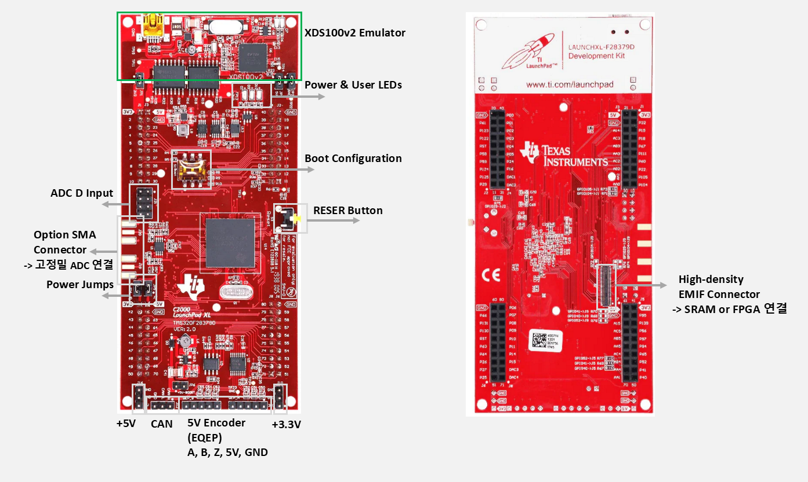

# TI_DSP_Study
#### LAUNCHXL-F28379D를 이용한 DSP 학습

## LAUNCHXL-F28379D 기능

- On-Board XDS100v2 JTAG Debug Probe (TI-Emulator 내장)
    - JTAG 디버깅
    - Breakpoint/Step, Flash Programming
    - SCIA를 USB-CDC로 변환해 PC와 UART 통신
- Dual 5V → 3.3V/1.2V LDO 전원 모듈 (내장 전원 레귤레이터)
    - 3.3V (I/O, MCU 주변)
    - 1.2V (F28379D CORE 전압)
- Dual Boot Mode & Boot-Config DIP Switches
    - 보드에 2개의 DIP 스위치가 있어 Boot Mode 선택 지원
    - Flash, SCI, SPI, Parallel/I2C, CAN Boot
- Dual 40-Pin BoosterPack Connectors
    - TI BoosterPack 확장 모듈을 2개 동시에 장착 가능
    - 표준 핀아웃 지원
- QEP/Encoder Connector (전용 ENCODER PORT)
    - Incremental Encoder를 바로 연결할 수 있는 전용 단자 제공
        - A/B/Z 신호 라인 모두 제공
        - 5V/3.3V 전원 출력
- CAN Bus Transceiver (On-Board)
    - 슈트 가능한 CAN 트랜시버가 내장됨 (SN65HVD230 계열)
        - CANH/CANL를 바로 꺼내 쓸 수 있음
        - Terminator(120Ω) 점퍼 제공
- Multiple LEDs + Push Button Modules
    - LED 4개 (일반 GPIO 테스트, Boot 상태 확인)
    - Button 2개 (Reset 버튼, User Button)
- On-board USB-to-UART Bridge
    - XDS100v2 내부에 UART-CDC가 들어 있음